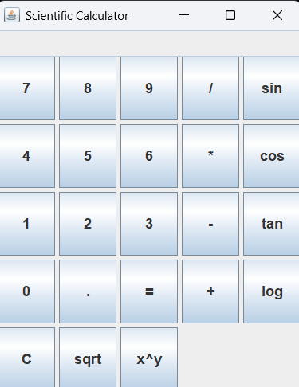

# 🔢 Scientific Calculator (Java Swing)

This is a desktop-based **Scientific Calculator** built using **Java Swing**. It performs basic arithmetic operations as well as scientific functions like sine, cosine, tangent, logarithm, square root, and power.

## 📷 Preview

  
*(Add a screenshot of your app here if you have one)*

---

## 💻 Features

- ✅ Basic operations: `+`, `-`, `*`, `/`
- ✅ Scientific functions: `sin`, `cos`, `tan`, `log`, `sqrt`, `x^y`
- ✅ Clean and responsive UI using `GridLayout`
- ✅ Error handling
- ✅ One-click clear (`C`) and equals (`=`)

---

## 🛠️ Technologies Used

- Java
- Java Swing (AWT + Swing)
- Math library functions

---

## 🚀 How to Run

1. **Clone the Repository**
   ```bash
   git clone https://github.com/your-username/scientific-calculator-java.git
   cd scientific-calculator-java
